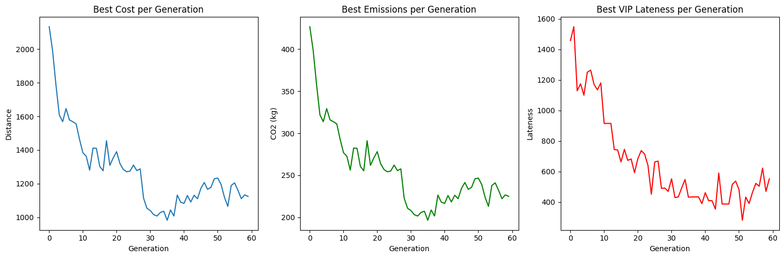
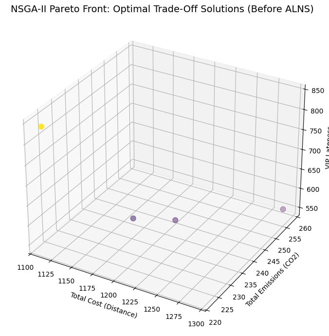
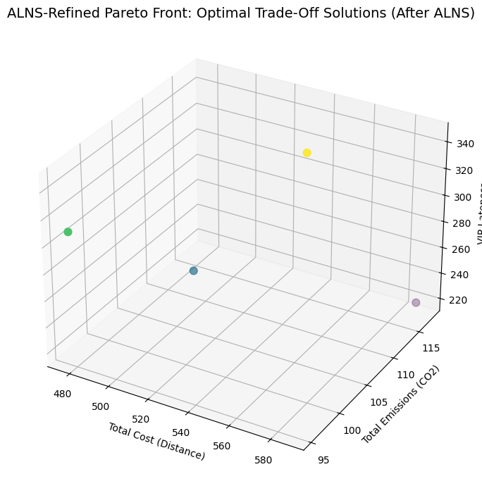
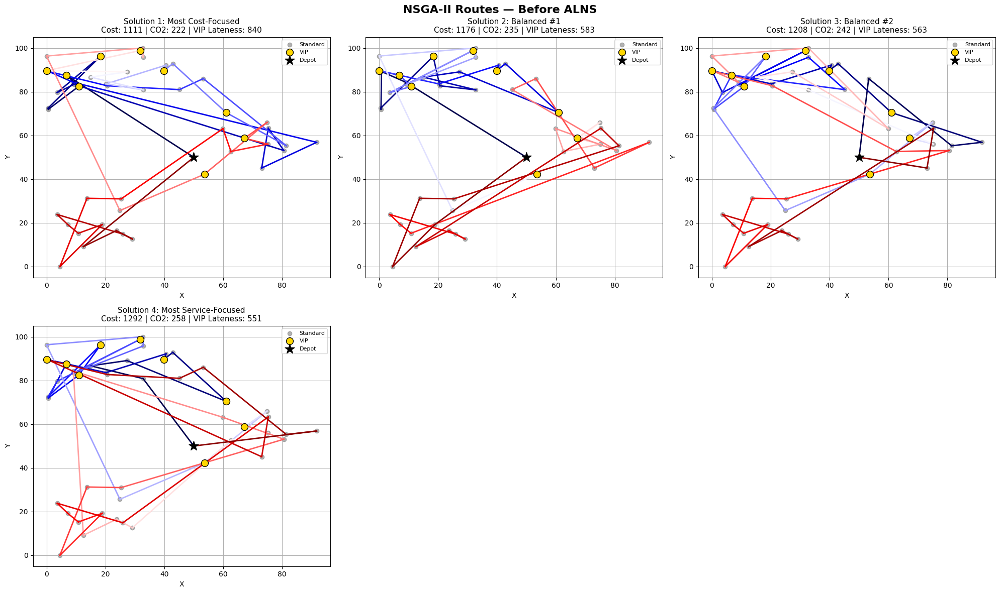
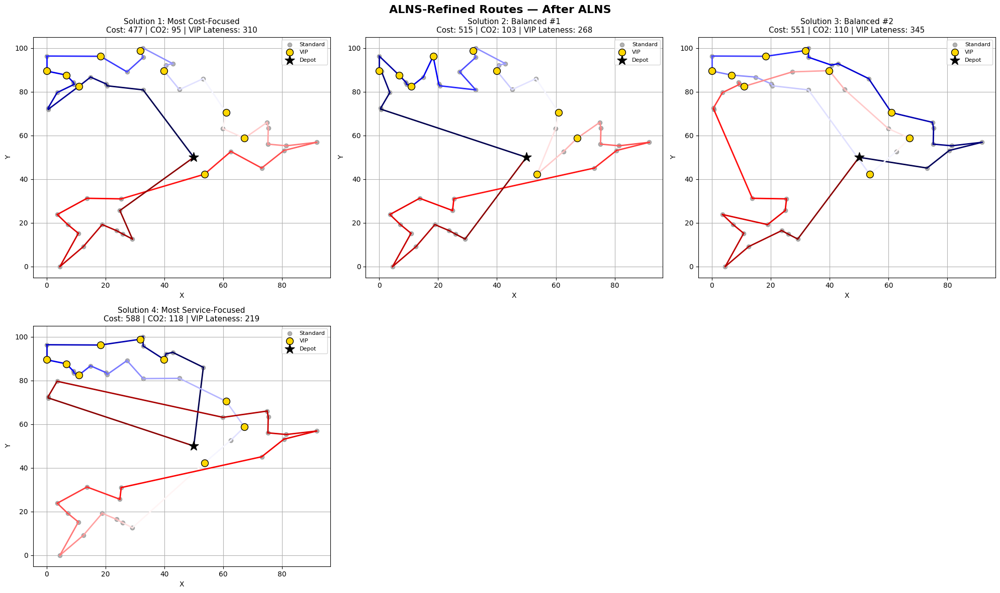

# A Multi-Objective VRP Solver using a Hybrid Memetic Algorithm
> by Rayan Hashemy

### Moving Beyond Just the 'Cheapest' Route

In supply chain, we're always chasing efficiency. But for a long time, that just meant one thing: finding the shortest, cheapest route possible. The problem is, the real world is a lot more complicated. The shortest route is rarely the best one.

What happens if the cheapest route has the highest CO2 emissions? Or what if it makes your most VIP customer upset because they get their delivery last? This is the strategic puzzle that has fascinated me, and it's the problem I built this project to solve.

I chose these three compelling objectives for this project, as I have found these to be the most common objectives companies in the supply chain industry are focusing on:
*   Economic Cost (total distance)
*   Environmental Impact (CO2 emissions)
*   Customer Service (prioritizing VIPs)

---

### 2. My Approach: How I Built a Smarter AI

My goal was to build an AI that could deliver a menu of optimal choices — a Pareto Front — rather than a single, one-size-fits-all answer. I built the project in two distinct phases that work sequentially, each tackling a different layer of the problem.

#### **Phase 1: The NSGA-II Baseline**
I started by implementing a Non-dominated Sorting Genetic Algorithm II (NSGA-II). This is a powerful evolutionary algorithm that runs for 500 generations across a population of 100 routes, exploring the entire solution space to find a strong set of trade-off solutions. This acts as the global strategist — broad, thorough, and effective at mapping out the landscape of possibilities.

#### **Phase 2: The ALNS Refinement Layer**
After analyzing the NSGA-II results, I identified the core limitation: the genetic algorithm is excellent at global exploration, but it doesn't spend enough time deeply optimizing any individual route. It finds good neighbourhoods, but rarely the best solution within them.

So I did more research and built a second stage: an Adaptive Large Neighborhood Search (ALNS) that runs after NSGA-II has fully completed. Once NSGA-II delivers its final Pareto front, every elite solution is handed to the ALNS engine for an intense, focused destroy-and-repair session. The ALNS systematically removes the most costly customers from each route and re-inserts them in the most efficient positions — repeatedly, intelligently, until no further improvement is possible.

This two-stage architecture is what makes the model a true Hybrid Memetic Algorithm: NSGA-II handles the global search, ALNS handles the local perfection.

---

### 3. Key Features & How It Works

*   **Multi-Objective Optimization:** The entire system is guided by three custom objective functions that score every route on Cost, CO2, and a unique "VIP Lateness" metric I designed to penalize routes that serve key accounts late.
*   **Two-Stage Hybrid Architecture:** NSGA-II runs to completion first, producing an initial Pareto front. ALNS then refines every solution on that front independently, producing the final, superior result.
*   **Adaptive Destroy & Repair:** The ALNS uses two destroy strategies (random removal and worst-cost removal) paired with a greedy repair operator, selecting operators adaptively to escape local optima.
*   **Realistic Problem Environment:** The model operates on a simulated dataset of 50 customers with different priority levels, a central depot, and different vehicle types with unique CO2 emission factors.

---

### 4. Results & Impact

The decision to run ALNS as a dedicated post-processing stage on the NSGA-II Pareto front was a definitive success. The results speak clearly: every single solution on the final Pareto front was dramatically improved across all three objectives simultaneously.

**NSGA-II Convergence** — all three objectives improving steadily across generations:

**Pareto Front — Before ALNS (NSGA-II output):**

**Pareto Front — After ALNS (refined solutions):**

The entire Pareto front shifts to a far better region of the objective space — not a marginal nudge, but a wholesale transformation across every solution, on every metric, simultaneously.

**Route Maps — Before ALNS** (routes are tangled with significant cross-overs):

**Route Maps — After ALNS** (routes are visibly cleaner, tighter, and more structured):

#### Proven Performance

The improvement from adding the ALNS refinement stage was not marginal — it was transformative:

*   **~57% reduction in total route cost (distance)** — the most cost-focused solution dropped from a distance of 1,111 to 477, less than half the original.
*   **~57% reduction in CO2 emissions** — because emissions scale directly with distance, every efficiency gain translates directly into an environmental win. The most cost-focused route fell from 222 kg CO2 to just 95 kg — cutting the carbon footprint of each delivery run by more than half.
*   **~59% reduction in VIP Lateness** — the ALNS naturally restructures routes to front-load high-priority customers, delivering a major service-level improvement as a direct byproduct of optimizing for efficiency.

*   **Strategic Decision Support:** The final output provides a clear, data-driven menu of elite solutions, empowering a business to choose a route that directly aligns with its strategic priority — whether that is minimising cost, cutting emissions, or maximising service to key accounts.

---

### 5. Technologies Used

**Core Development:**
- **Language:** Python
- **Libraries:** Pandas for data manipulation, NumPy for numerical operations, Matplotlib for visualization
- **Environment:** Google Colab

**Research & Prototyping:**
- **AI Research Assistants:** Used to accelerate the initial literature review and synthesize key concepts from academic papers (Elicit)
- **AI Code Assistants:** Leveraged for boilerplate code generation, debugging, and accelerating the overall prototyping and development process (Claude, Gemini)
